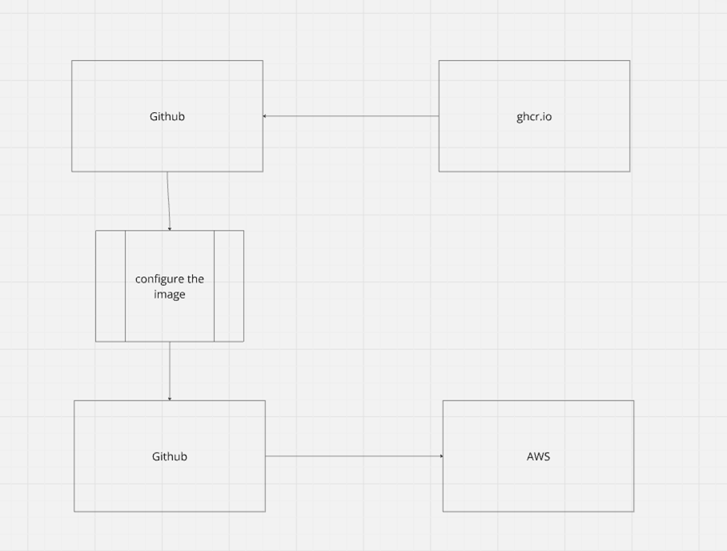
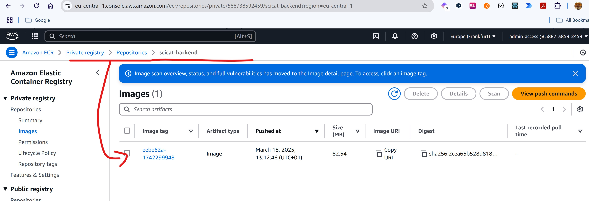
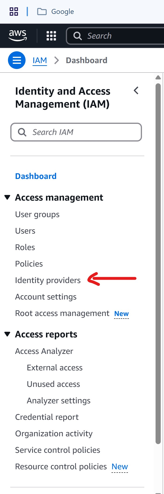
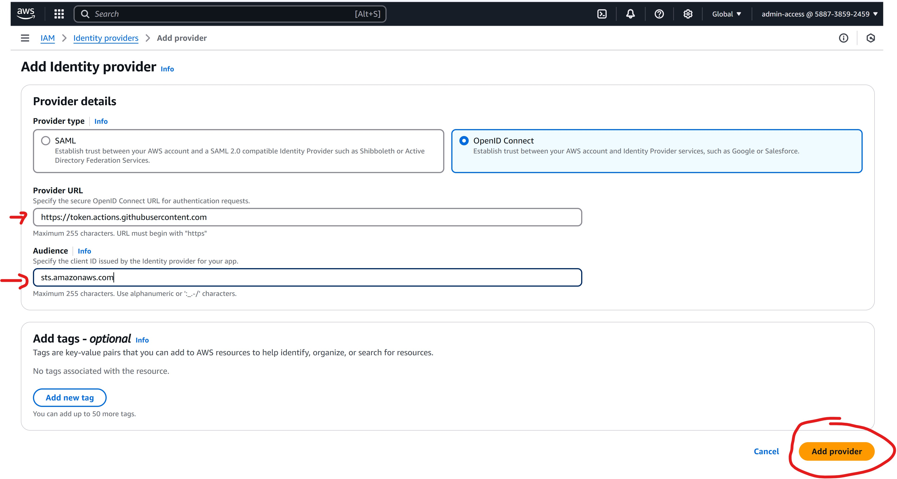
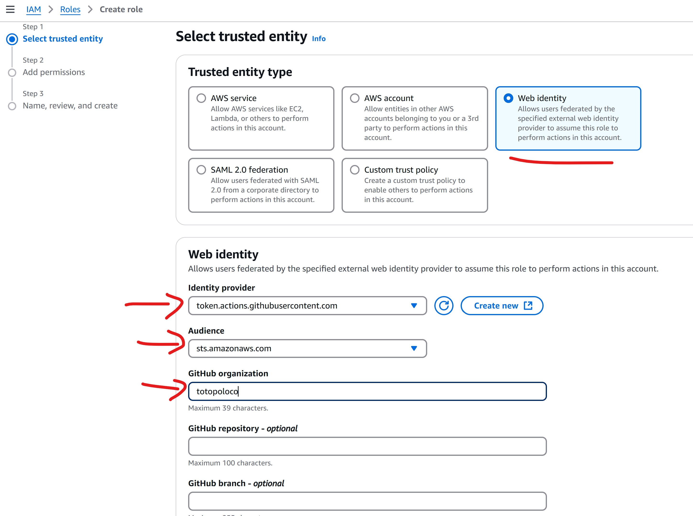
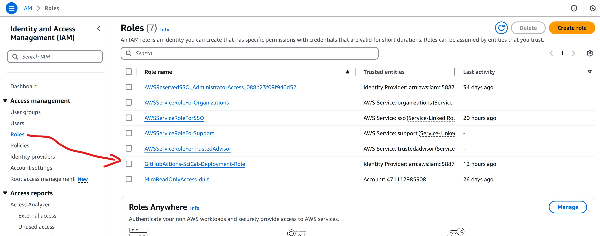
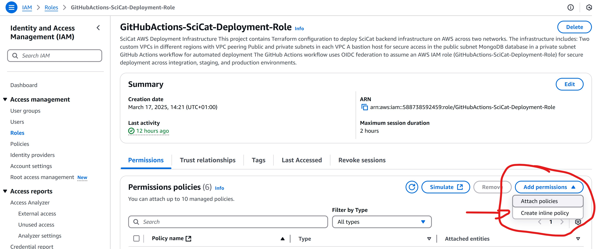
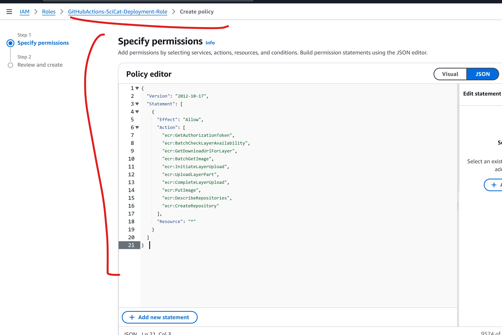
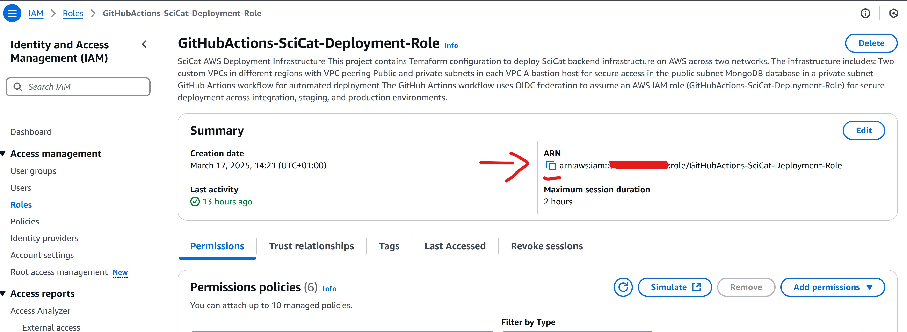
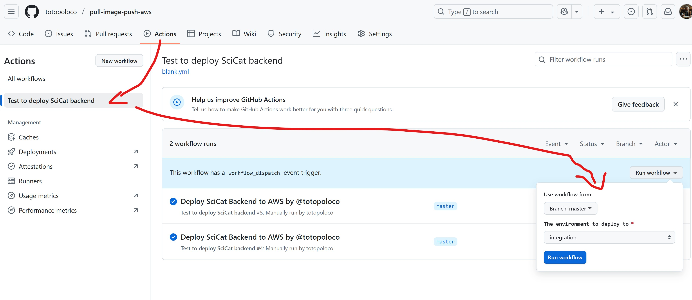

# Scicat Backend Next Deployment

This repository contains the deployment scripts for the scicat-backend-next software stack.

The intention is a proof of concept for the image configuration and storage of the scicat-backend-next software in AWS.

## Prerequisites
AWS account and credentials for the account. 
[Amazon AWS](https://console.aws.amazon.com/)

### Behind the scenes

##### Short description of the workflow
The workflow will pull an image (SciCat Backend) from the Docker Hub repository and push it to the AWS ECR repository.



##### Detailed description of the workflow
The workflow is triggered manually by selecting the workflow in the Actions tab in the GitHub repository.
When the workflow is triggered, the following steps are executed:
- The workflow will pull the image from the Docker Hub repository.
- The workflow creates the configuration files for the image in the `config` directory.
  - The configuration files are `functionalAccounts.json`, `proposalTypes.json` and `.env`.
- The workflow will add the files to the image:
  - `functionalAccounts.json`
  - `proposalTypes.json`
  - `.env`
- The script will commit this new modified image.
- The script will authenticate to AWS.
- The script will push the image to the AWS ECR repository.

A sample log of the workflow can be accesed [here](./doc_elements/job-logs.txt).

### ECR repository
The resulting image will be stored in the ECR repository in the AWS account as shown in the image below.



## Configuration in AWS
Different steps are needed to configure the AWS account for the deployment of the scicat-backend-next software stack.
The description of how to configure the AWS account is described below.

### Identity Provider
The identity provider is the service used to authenticate the users in the AWS account.
It will allow connecting GitHub to the AWS account and use the GitHub organization to authenticate the user to push 
the image to the AWS account.
The identity provider is configured in the AWS console in the IAM service.

- Go to the AWS console and select the IAM service
- Select the Identity providers in the left menu as shown in the image below 
- Click on the Create Provider button
- Select the provider type OpenID Connect
  - Provider URL: https://token.actions.githubusercontent.com
  - Audience: sts.amazonaws.com
  - Click on the Add provider button 
 
    

- Assign a role
  - Click on the Roles in the left menu
  - Select Web Identity
  - Select the Identity provider that was created
  - Select the Audience that was created
  - in GitHub organization, select the organization used for the deployment, in this case `totopoloco` for this repository.
 
    

- Assign the permissions to the role
  - In the "Add permissions" screen, select the following permissions:
    - AmazonDynamoDBFullAccess
    - AmazonEC2FullAccess
    - AmazonS3ReadOnlyAccess
    - AmazonVPCFullAccess
    - IAMReadOnlyAccess
  - Assign the following name to the role: `GitHubActions-SciCat-Deployment-Role`
  - Once the role is created, it will be displayed in the list of roles

    
  - Select the newly created role and add an inline policy with the following policy:
  
  
```json
{
  "Version": "2012-10-17",
  "Statement": [
    {
      "Effect": "Allow",
      "Action": [
        "ecr:GetAuthorizationToken",
        "ecr:BatchCheckLayerAvailability",
        "ecr:GetDownloadUrlForLayer",
        "ecr:BatchGetImage",
        "ecr:InitiateLayerUpload",
        "ecr:UploadLayerPart",
        "ecr:CompleteLayerUpload",
        "ecr:PutImage",
        "ecr:DescribeRepositories",
        "ecr:CreateRepository"
      ],
      "Resource": "*"
    }
  ]
}   
```
  - Assign a Trust relationship to the role with the following trust policy (replace the `XXXXXXXX` with the AWS account number):
```json
{
    "Version": "2012-10-17",
    "Statement": [
        {
            "Effect": "Allow",
            "Principal": {
                "Federated": "arn:aws:iam::XXXXXXXXXXXXXXX:oidc-provider/token.actions.githubusercontent.com"
            },
            "Action": "sts:AssumeRoleWithWebIdentity",
            "Condition": {
                "StringEquals": {
                    "token.actions.githubusercontent.com:aud": "sts.amazonaws.com"
                },
                "StringLike": {
                    "token.actions.githubusercontent.com:sub": "repo:totopoloco/pull-image-push-aws:environment:*"
                }
            }
        }
    ]
}
```
  - The purpose of the trust policy is to allow the GitHub organization to assume the role and push the image to the ECR repository.

- The role is now created and can be used in the GitHub repository for the deployment.


## Configuration in GitHub
The GitHub repository needs to be configured to use the AWS account for the deployment.

### Environment variables

In AWS copy the ARN of the role that was created in the previous step. See the following image for an example of the ARN.


In the GitHub repository, go to the settings and select the Environment on the left menu.
- Click on the New environment button.
- Set a new environment name, for example, `staging` and click on the Configure environment button.
- Click an environment secret and add the following secrets:
  - ROLE_ARN_DEPLOY: the ARN of the role that was created in the previous step
    - The value should be the ARN copied from the AWS console e.g. `arn:aws:iam::XXXXXXXXXXXXXXX:role/GitHubActions-SciCat-Deployment-Role`

### Execution of the workflow

The workflow for this demo is defined in the `.github/workflows/demo_pull_push.yml` file.

The workflow is triggered manually by selecting the workflow in the Actions tab in the GitHub repository.

